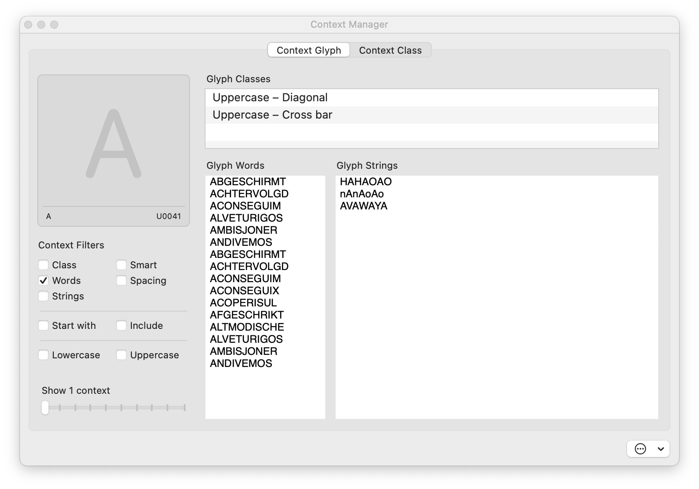

 

  

# Context Manager
>### Build your own contextual words/strings library and access it dynamically.  

 
Context Manager is a Glyphs 3 Plugin which is intended to help and speed up your workflow when you are looking for a word/string to proof a specific glyph. It allow user to manage contextual words/strings for each glyph and to create contextual group.  

 

This plugin comes with a database for Latin, Cyrillic and Greek letters. This database was built using an algorithm that analysed dictionaries of different languages to establish a list of the most effective words to prove each letter.

⚠️ Do not download directly from here. Please install via GlyphsApp’s Plugin Manager ⚠️

 

___
 

## Installation
From Glyphs App go to `Window > Plugin Manager`, search `Context Manager`, install it and restart Glyphs.  
This is a 30-days trial version, with same features as paid version.

  

## How to use

Context Manager add two items in your `Edit` menu:  
- `Context Manager` : An interface to create/edit plugin settings. 
- `Set Context…` : A script that randomly selects content from your context library and filter settings.

I highly recommend to assign a shortcut to `Set Context…` to trigger it more easily.  
For that go in `Glyphs > Preferences`, in `Shortcuts` section, search `Set Context…`, and record a shortcut here.

  

## How it work

1. Each glyph can be assigned Context Classes, Context Words and Context String.  
2. Filters are used to choose which Context source are enable or disable.  
3. When you select a glyph, running `Set Context…` will pick randomly a Context between activated filters, and use it in your current tab.

  

## Context Manager UI

 Show documentation

### 1. Filters
&emsp;&ensp;Filters allow user to choose which context to use when `Edit > Find Context` is triggered.  
&emsp;&ensp;(ex : if `Class` and `Words` are checked, it will pick randomly a word from `Glyph Classes` or `Glyph Words`)

 

- `Class` &emsp;&ensp; &ensp; &emsp; &nbsp; :&emsp; add content from `Glyph Classes`
- `Word` &emsp;&ensp; &ensp; &emsp; &emsp;: &emsp;  add content from `Glyph Words`
- `String` &ensp; &ensp; &emsp; &emsp;: &emsp;add content from `Glyph Strings`
- `Smart` &emsp; &ensp; &emsp; &emsp;: &emsp;add content based on glyphs from classes displayed in `Glyph Classes`  
- `Spacing` &nbsp; &ensp; &emsp; &ensp; : &emsp;add string `HxHxOxOxnxnxoxo`, where "x" is your selected glyph.

 

- `Start With` &nbsp; &ensp; &ensp;: &emsp;filter word that start with your selected glyph
- `Include` &nbsp; &ensp;&ensp; &ensp; &ensp; : &emsp;filter word that contain but not start with your selected glyph

 

- `Uppercase` &nbsp; &nbsp;  &ensp; &ensp; : &emsp;change case to "Uppercase" (except selected glyph)
- `Lowercase` &nbsp; &ensp;&ensp; &ensp;  : &emsp;change case to "Lowercase" (except selected glyph)

---

### 2. Glyph Classes
&emsp;&ensp;Show for selected glyph, all Context Class which contain this glyph.  
&emsp;&ensp;(ex : if you set `Lowercase – Ascender` and `Lowercase – Round` both with letter `b` inside, these classes will be displayed here)

---

### 3. Glyph Words
&emsp;&ensp;List all your saved words of your selected glyph.  
&emsp;&ensp;You can add/remove/edit word.  ( ⚠️ Be sure to separate your words by a line break ⚠️)

---

### 4. Glyph Strings
&emsp;&ensp;List all your saved strings of your selected glyph.  
&emsp;&ensp;You can add/remove/edit strings.  (⚠️ Be sure to separate your strings by a line break ⚠️)

---

### 5. Context Classes
&emsp;&ensp;This is your Context Classe library. It list all your Context Class saved.  
&emsp;&ensp;Context Classe are used to share same contents between different glyphs.  
>&emsp;Instead of adding `"chocolate"` word in `Glyph Words` for letters `o`, `c` and `e`, you can create a `Context Class`,  
>&emsp;with these 3 letters, and add `"chocolate"` in `Class Strings`

&emsp;&ensp;To create a class, press the (+) button and type a Class name.   
&emsp;&ensp;To delete a class, select it and press (-) button.  
&emsp;&ensp;You can also rename an existing class by double clicking on it. 

---

### 6. Class Glyphs
&emsp;&ensp;After selecting a Context Class, it show all glyph present in this class.
&emsp;&ensp;All glyph in a classe share the same content.  
&emsp;&ensp;To add glyphs, select them in Font View and press (+) button. To delete glyphs, selected them and press (-) button or DEL key.-

---

### 7. Class Strings
&emsp;&ensp;Text entry control, where you can add strings that contain glyph from selected Context Class.

  

## Config File
At first start, Context Manager will create a JSON file **Context Manager.json** store here :  
`~/Library/Application Support/Glyphs 3/info/ContextManager.json`

This file can be edited directly from the Context Manager UI or by being open with a text editor like Sublime Text or VSCode. To share your Context Manager settings, you just have to share this file and placed it here:  
`~/Library/Application Support/Glyphs 3/info`

  

## Extra Features
Some additionnal features are accesible via bottom right action button.
- `Reset Context Manager settings` : Reset your actual settings.
- `Import Context Manager settings` : Replace your actual settings by another setting file.
- `Merge Context Manager settings with another file` : Import data from another setting file in your actual settings.

  

## How to buy paid version
If you trial ended, you can buy a licence here: *(soon available)*

